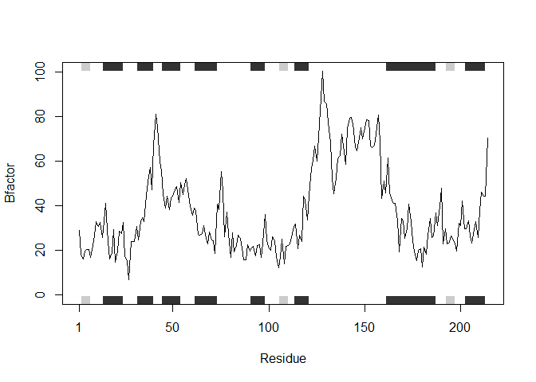
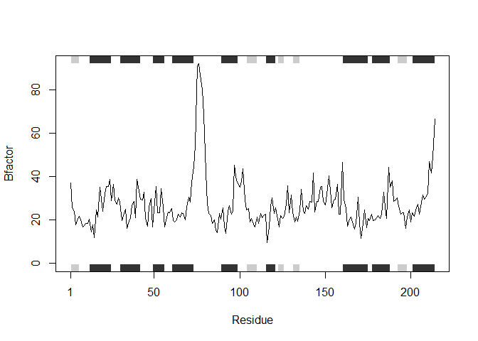
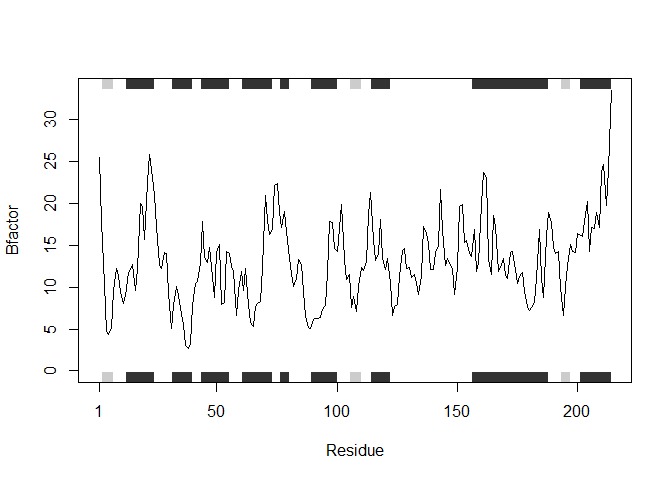
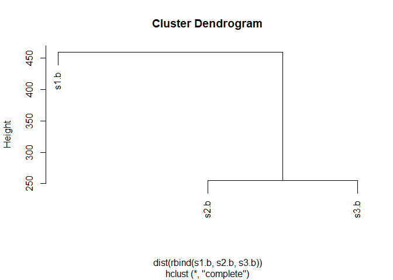

Class 6 R Functions
================
Yu Zhang
2019/10/18

``` r
read.table("test1.txt",sep = ",")
```

    ##     V1   V2   V3
    ## 1 Col1 Col2 Col3
    ## 2    1    2    3
    ## 3    4    5    6
    ## 4    7    8    9
    ## 5    a    b    c

``` r
read.table("test2.txt",sep = "$")
```

    ##     V1   V2   V3
    ## 1 Col1 Col2 Col3
    ## 2    1    2    3
    ## 3    4    5    6
    ## 4    7    8    9
    ## 5    a    b    c

``` r
read.table("test3.txt", sep = "")
```

    ##   V1 V2 V3
    ## 1  1  6  a
    ## 2  2  7  b
    ## 3  3  8  c
    ## 4  4  9  d
    ## 5  5 10  e

``` r
add <- function(x, y=1) {
 # Sum the input x and y
 x + y
}
add(2)
```

    ## [1] 3

``` r
add(c(1,2),2)
```

    ## [1] 3 4

``` r
add(nchar("2sd"))
```

    ## [1] 4

``` r
x <- c(1,3,4)
range(x)
```

    ## [1] 1 4

``` r
rescale <- function(x, na.rm=TRUE, plot=FALSE) {
 if(na.rm) {
 rng <-range(x, na.rm=TRUE)
 } else {
 rng <-range(x)
 }
 print("Hello")
 answer <- (x - rng[1]) / (rng[2] - rng[1])
 return(answer) #skips the rest of the calculations
 print("is it me you are looking for?")
 if(plot) {
 plot(answer, typ="b", lwd=4)
 }
 print("I can see it in ...")
}
```

``` r
library(bio3d)
s1 <- read.pdb("4AKE") # kinase with drug
```

    ##   Note: Accessing on-line PDB file

``` r
s2 <- read.pdb("1AKE") # kinase no drug
```

    ##   Note: Accessing on-line PDB file
    ##    PDB has ALT records, taking A only, rm.alt=TRUE

``` r
s3 <- read.pdb("1E4Y") # kinase with drug
```

    ##   Note: Accessing on-line PDB file

``` r
s1.chainA <- trim.pdb(s1, chain="A", elety="CA")
s2.chainA <- trim.pdb(s2, chain="A", elety="CA")
s3.chainA <- trim.pdb(s3, chain="A", elety="CA")
s1.b <- s1.chainA$atom$b
s2.b <- s2.chainA$atom$b
s3.b <- s3.chainA$atom$b
#par(mfrow = c(1,3))
plotb3(s1.b, sse=s1.chainA, typ="l", ylab="Bfactor")
```

<!-- -->

``` r
#points(s2.b, typ = "l", col = "blue")
plotb3(s2.b, sse=s2.chainA, typ="l", ylab="Bfactor")
```

<!-- -->

``` r
plotb3(s3.b, sse=s3.chainA, typ="l", ylab="Bfactor")
```

<!-- -->

``` r
hc <- hclust( dist( rbind(s1.b, s2.b, s3.b) ) )
plot(hc)
```

<!-- -->

``` r
#library(bio3d)
prostr <- function(x, chain_name = "A", elety_name = "CA", yl = "Bfactor", atom_col = "b"){
  s <- read.pdb(x)
  s.chain <- trim.pdb(s, chain = chain_name, elety = elety_name)
  s.atom <- s.chain$atom[,atom_col]
  plotb3(s.atom, sse=s.chain, typ="l", ylab = yl)
}
prostr("4AKE")
```

    ##   Note: Accessing on-line PDB file

    ## Warning in get.pdb(file, path = tempdir(), verbose = FALSE): C:
    ## \Users\padsdoc\AppData\Local\Temp\RtmpgLb9iF/4AKE.pdb exists. Skipping
    ## download

<!-- -->
