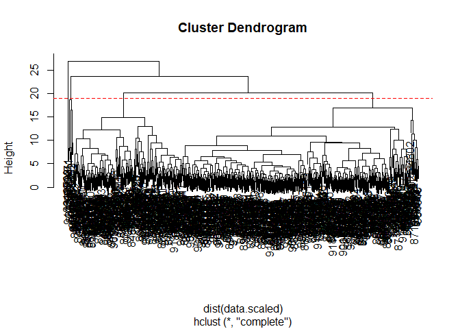
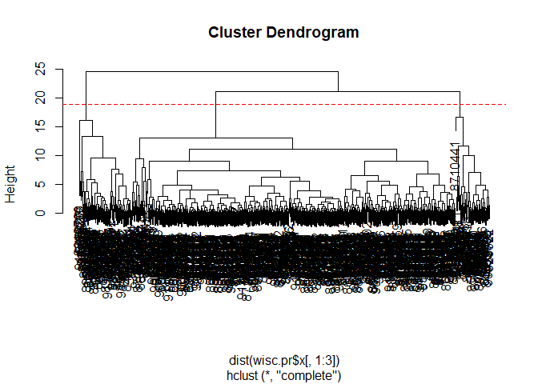

class09
================
Yu Zhang
2019/10/30

``` r
fna.data <- "WisconsinCancer.csv"
wisc.df <- read.csv(fna.data)
table(wisc.df$diagnosis)
```

    ## 
    ##   B   M 
    ## 357 212

``` r
colnames(wisc.df)
```

    ##  [1] "id"                      "diagnosis"              
    ##  [3] "radius_mean"             "texture_mean"           
    ##  [5] "perimeter_mean"          "area_mean"              
    ##  [7] "smoothness_mean"         "compactness_mean"       
    ##  [9] "concavity_mean"          "concave.points_mean"    
    ## [11] "symmetry_mean"           "fractal_dimension_mean" 
    ## [13] "radius_se"               "texture_se"             
    ## [15] "perimeter_se"            "area_se"                
    ## [17] "smoothness_se"           "compactness_se"         
    ## [19] "concavity_se"            "concave.points_se"      
    ## [21] "symmetry_se"             "fractal_dimension_se"   
    ## [23] "radius_worst"            "texture_worst"          
    ## [25] "perimeter_worst"         "area_worst"             
    ## [27] "smoothness_worst"        "compactness_worst"      
    ## [29] "concavity_worst"         "concave.points_worst"   
    ## [31] "symmetry_worst"          "fractal_dimension_worst"
    ## [33] "X"

``` r
gg <- grep('_mean', colnames(wisc.df), value = T)
xx <- wisc.df[gg]
```

Here we examine data from 569 patient samples. In this data-set we have
357 Breast Cancer diagnosis and 212malignant diagnosis.

``` r
wisc.data <- as.matrix(wisc.df[,3:32])
row.names(wisc.data) <- wisc.df$id
diagnosis <- wisc.df$diagnosis
colMeans(wisc.data)
```

    ##             radius_mean            texture_mean          perimeter_mean 
    ##            1.412729e+01            1.928965e+01            9.196903e+01 
    ##               area_mean         smoothness_mean        compactness_mean 
    ##            6.548891e+02            9.636028e-02            1.043410e-01 
    ##          concavity_mean     concave.points_mean           symmetry_mean 
    ##            8.879932e-02            4.891915e-02            1.811619e-01 
    ##  fractal_dimension_mean               radius_se              texture_se 
    ##            6.279761e-02            4.051721e-01            1.216853e+00 
    ##            perimeter_se                 area_se           smoothness_se 
    ##            2.866059e+00            4.033708e+01            7.040979e-03 
    ##          compactness_se            concavity_se       concave.points_se 
    ##            2.547814e-02            3.189372e-02            1.179614e-02 
    ##             symmetry_se    fractal_dimension_se            radius_worst 
    ##            2.054230e-02            3.794904e-03            1.626919e+01 
    ##           texture_worst         perimeter_worst              area_worst 
    ##            2.567722e+01            1.072612e+02            8.805831e+02 
    ##        smoothness_worst       compactness_worst         concavity_worst 
    ##            1.323686e-01            2.542650e-01            2.721885e-01 
    ##    concave.points_worst          symmetry_worst fractal_dimension_worst 
    ##            1.146062e-01            2.900756e-01            8.394582e-02

``` r
round(apply(wisc.data,2,sd),3) 
```

    ##             radius_mean            texture_mean          perimeter_mean 
    ##                   3.524                   4.301                  24.299 
    ##               area_mean         smoothness_mean        compactness_mean 
    ##                 351.914                   0.014                   0.053 
    ##          concavity_mean     concave.points_mean           symmetry_mean 
    ##                   0.080                   0.039                   0.027 
    ##  fractal_dimension_mean               radius_se              texture_se 
    ##                   0.007                   0.277                   0.552 
    ##            perimeter_se                 area_se           smoothness_se 
    ##                   2.022                  45.491                   0.003 
    ##          compactness_se            concavity_se       concave.points_se 
    ##                   0.018                   0.030                   0.006 
    ##             symmetry_se    fractal_dimension_se            radius_worst 
    ##                   0.008                   0.003                   4.833 
    ##           texture_worst         perimeter_worst              area_worst 
    ##                   6.146                  33.603                 569.357 
    ##        smoothness_worst       compactness_worst         concavity_worst 
    ##                   0.023                   0.157                   0.209 
    ##    concave.points_worst          symmetry_worst fractal_dimension_worst 
    ##                   0.066                   0.062                   0.018

``` r
# where 2 is the margin: when MARGIN=1 , it applies over rows, whereas with MARGIN=2 , it works over columns
# we want the sd to be similar but area_mean is on a different scale ~300 so we need to scale in pca
```

``` r
wisc.pr <- prcomp(wisc.data, scale=T)
x <- summary(wisc.pr)
```

``` r
plot(wisc.pr$x[,1],wisc.pr$x[,2], col=diagnosis, xlab = "PC1", ylab = "PC2")
```

<!-- -->

``` r
x$importance[2,"PC1"]
```

    ## [1] 0.44272

``` r
which(x$importance[3,]>0.9)[1]
```

    ## PC7 
    ##   7

## 

``` r
data.scaled <- scale(wisc.data)
wisc.hclust <- hclust(dist(data.scaled), method = "complete")
wisc.hclust
```

    ## 
    ## Call:
    ## hclust(d = dist(data.scaled), method = "complete")
    ## 
    ## Cluster method   : complete 
    ## Distance         : euclidean 
    ## Number of objects: 569

``` r
plot(wisc.hclust)
abline(h=19, col="red", lty=2)
```

<!-- -->

``` r
wisc.hclust2 <- hclust(dist(wisc.pr$x[,1:3]))
wisc.hclust2
```

    ## 
    ## Call:
    ## hclust(d = dist(wisc.pr$x[, 1:3]))
    ## 
    ## Cluster method   : complete 
    ## Distance         : euclidean 
    ## Number of objects: 569

``` r
plot(wisc.hclust2)
abline(h=19, col="red", lty=2)
```

<!-- -->

``` r
wisc.hclust.clusters <- cutree(wisc.hclust, k = 4)
table(wisc.hclust.clusters, diagnosis)
```

    ##                     diagnosis
    ## wisc.hclust.clusters   B   M
    ##                    1  12 165
    ##                    2   2   5
    ##                    3 343  40
    ##                    4   0   2

``` r
wisc.hclust.clusters2 <- cutree(wisc.hclust2, k = 4)
table(wisc.hclust.clusters2, diagnosis)
```

    ##                      diagnosis
    ## wisc.hclust.clusters2   B   M
    ##                     1   1  45
    ##                     2 355  94
    ##                     3   0  73
    ##                     4   1   0

## K-means

can also do spell check in R: edit -\> check spelling
